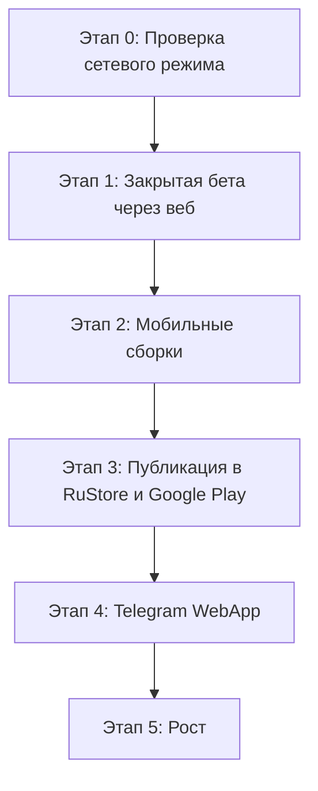

# Дорожная карта запуска — SplitIT (Сплит-Чек)

**Обновлена:** 2026-08-01

## Где мы сейчас

| | |
|---|---|
| Веб | https://split-it-ere9.vercel.app — развёрнут, сетевой режим включён |
| Репозиторий | github.com/alexflin777-svg/SplitIt (приватный) |
| База | Supabase `jrarbbfsqrkjckujfpcz`, 5 миграций применены |
| Мобильные сборки | APK и IPA собирались до перехода на сетевой режим — **устарели**, нужна пересборка |

**Что подтверждено:** схема и политики доступа на живой базе (анонимное чтение
пусто, запись 401, функции только для `authenticated`), 28 проверок RLS на
настоящем PostgreSQL, 72 E2E по собранному артефакту.

**Что не подтверждено:** ни один сценарий под живой пользовательской сессией.
GoTrue, PostgREST и Realtime ни разу не проверены с настоящим входом. До этого
прогона считать многопользовательский режим рабочим нельзя.

---

## Архитектура данных

Приложение живёт в двух режимах и переключается по наличию ключей Supabase.
Экраны про режим не знают — решение принимает `isMultiUser()` в
`src/lib/store.ts`.

| | Локальный режим | Сетевой режим (сейчас на проде) |
|---|---|---|
| Данные | localStorage одного устройства | общая база, доступ режет RLS |
| Вход | пароль сверяется локально | Supabase Auth |
| Участники | добавляются по имени | вступают по ссылке-приглашению |
| Синхронизация | между вкладками | между устройствами, Postgres Changes |

Локальный режим не отключён и не является заглушкой: он остаётся рабочим
состоянием для сборки без ключей и честно сообщает о своих ограничениях.

---

## Этапы

### Этап 0. Проверка сетевого режима — блокирует всё остальное

Пока не пройден. Всё, что ниже, строится на предположении, что сетевой режим
работает; если он не работает, вся дальнейшая работа окажется на песке.

1. Прогон двумя аккаунтами по сценарию из `SUPABASE_SETUP.md`: A создаёт
   событие с расходом, B его не видит, A делится ссылкой, B вступает, оба видят
   баланс, изменение у A появляется у B без перезагрузки, после выхода B теряет
   доступ.
2. Попытка сломать: B открывает `/events/detail?id=<чужой id>` напрямую — должен
   получить «Событие недоступно».
3. Settings → Authentication → URL Configuration в Supabase: Site URL и
   `/auth` в Redirect URLs, иначе сброс пароля ведёт на localhost.

**Исполнитель:** 🔍 CODEX в роли Чекера. Результат — в `bug_report.md`.

### Этап 1. Закрытая бета через веб (1–2 недели)

Раньше здесь стояла раздача APK. Веб-версия проще: ссылка открывается на любом
устройстве, обновления доезжают сразу, откатить деплой — одна кнопка. APK
имеет смысл, когда веб-сценарий уже подтверждён.

- **Аудитория:** 15–30 человек — совместные поездки, аренда, компании.
- **Дистрибуция:** ссылка на веб-версию.
- **Что смотреть:**
  - доходит ли человек от регистрации до первого расхода без подсказок;
  - работает ли приглашение при пересылке в мессенджер;
  - совпадает ли расчёт долгов с тем, что люди посчитали бы сами;
  - распознаётся ли чек с реальной фотографии, а не с идеального скана.

**Перед стартом обязательно:** решить про подтверждение email. Если оно включено,
а SMTP не настроен, тестировщики не смогут войти после регистрации.

### Этап 2. Мобильные сборки

Текущие APK и IPA собраны до перехода на сетевой режим и не содержат ни ключей
Supabase, ни исправлений пяти кругов. Их нельзя раздавать.

- Пересобрать через Capacitor из актуального `out/`.
- Проверить, что в WebView работают приглашения: `window.location.origin` там
  указывает на локальный WebView, поэтому ссылки строятся из
  `NEXT_PUBLIC_APP_URL` — на Vercel он проставляется автоматически.
- Проверить офлайн-поведение: приложение заявлено offline-first, но сетевой
  режим требует соединения. Что видит пользователь в метро — открытый вопрос,
  сценарий не покрыт тестами.

### Этап 3. Публикация в RuStore и Google Play

- Подписанный AAB: `cd android && ./gradlew bundleRelease`.
- Карточка приложения: скриншоты, позиционирование
  *«Раздели чек в один клик, без математики и обид»*.
- Политика конфиденциальности — обязательна: приложение хранит email, телефон и
  историю трат в Supabase.
- Прописать, какие данные собираются и где размещены — требование обоих
  магазинов.

### Этап 4. Telegram WebApp

- Бот открывает веб-версию внутри Telegram, скачивать ничего не нужно.
- Виральность: приглашение пересылается в чат одним сообщением.
- **Не готово:** авто-авторизация через Telegram есть в коде, но для сетевого
  режима отключена — `initData` не проверяется на сервере, а без проверки это
  вход по данным, которые клиент может подделать. Нужен серверный обмен
  `initData` на сессию Supabase.

### Этап 5. Рост

- Виральная петля: ссылка-приглашение и есть механизм роста, каждое событие
  приводит остальных участников.
- Контент про то, как делить расходы в поездках без ссор.
- Партнёрства с тревел-блогерами и организаторами туров.

---

## Что мешает прямо сейчас

| Препятствие | Кто снимает |
|---|---|
| Сетевой режим не проверен под живой сессией | 🔍 CODEX |
| Расчёты покрыты одним тестом, конвертация валют — ни одним | 🧠 Claude Code |
| Мобильные сборки устарели | 🎨 Gemini |
| Нет проверки прода после деплоя | 🧠 Claude Code |
| Десктопная вёрстка `/auth` обрезана | 🎨 Gemini |

Подробности и приоритеты — `todo.md`.
