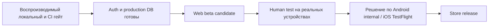

# Дорожная карта запуска — SplitIT

**Обновлена:** 2026-08-15 @ `50945f3`
**Актуальный рабочий backlog:** [`todo.md`](todo.md). Этот документ описывает только последовательность решений; он не заменяет доказательства из `bug_report.md`.

## Принцип запуска

Сначала доказываем один безопасный пользовательский сценарий в web-версии, затем проверяем его людьми на реальных устройствах, и только после этого начинаем Store-подготовку. Нельзя использовать старые APK/IPA, simulator build или прошлые отчёты как доказательство готовности физического устройства.

## Этап 0 — восстановить достоверный гейт

**Цель:** у команды есть один воспроизводимый способ проверить кандидат, а не противоречивые исторические результаты.

- ✅ Node закреплён: канон 24, диапазон 22–24 в `.nvmrc`, `engines`, README и CI.
- ✅ Test runner переведён на закреплённый `tsx`; `npm ci`, unit, RLS и Playwright выполняются с нуля.
- ✅ Незакоммиченные UI-изменения отделены и зафиксированы (`d091c45`), миграции идут отдельными файлами.
- ✅ Гейт восстановлен как механизм: скрипт `lint` больше не заглушка, подмена ловится первым шагом CI (`4de8d1f`).
- ✅ Полный прогон на чистом дереве: lint 0, tsc 0, unit 54/54, RLS 90/90, `npm test` 96 passed @ `50945f3`.
- ⬜ **Осталось:** влить ветку в `main`, получить первый зелёный run GitHub Actions на Node 24 и сохранить ссылку в P0-1.

**Выход:** свежий лог полного гейта ✅, commit SHA ✅, ссылка на CI-run ⬜, независимое Checker-review ⬜.

> Урок этого этапа: гейт, который можно выключить одной строкой в `package.json`, — не гейт. С 10.08 по 15.08 шаг «lint» в CI печатал строку вместо проверки, а E2E на `main` падал. Поэтому Этап 0 теперь считается закрытым только по ссылке на настоящий CI-run, а не по локальному выводу.

## Этап 1 — разблокировать закрытую web beta

**Цель:** ссылка на web-кандидат безопасна для 15–30 добровольных тестировщиков.

1. Владелец настраивает Supabase Auth URL Configuration и принимает решение о подтверждении email/SMTP.
2. Перед production-миграцией `group_participants` создаётся точка восстановления и выполняется legacy preflight.
3. Миграция применяется штатным способом; после неё запускаются безопасные `verify:prod`, `verify:realtime`, canary и проверяется cleanup.
4. UX-проверка собранного `out/` на 375×812, 390×844, 412×915 и 1280×720 закрывает safe-area, BottomNav, favicon и ошибочные success-состояния.
5. Зелёный commit деплоится; фиксируются URL, SHA, время, rollback-версия и ссылка на CI.

**Необходимое решение владельца:** если production Supabase/migration не готовы, beta не маскируется под сетевую. Допустим только явно обозначенный локальный режим с его ограничениями.

## Этап 2 — тестирование людьми на реальных устройствах

**Цель:** проверить понятность и надёжность полного сценария с двумя людьми, а не только emulator/автотесты.

- **Web/PWA:** Android Chrome и iPhone Safari обязательны; для iOS этого достаточно до решения о TestFlight.
- **Android internal:** возможен после сборки актуального production `out/`, `cap sync`, checksum и явной маркировки internal/debug. Store signing не является условием web beta.
- **iOS native:** только TestFlight/Ad Hoc с валидной подписью и provisioning profile. Simulator и unsigned IPA не принимаются.
- **Чартер и критерии:** в P1-5 `todo.md`; результаты, девайс/ОС, build SHA и дефекты фиксируются в `bug_report.md`.

**Выход:** все S1/S2 устранены или явно приняты владельцем, повторный гейт зелёный, есть таблица фактических device results.

## Этап 3 — Store release (только после успешной beta)

### Android

- release upload key хранится вне git;
- сборка подписанного AAB из подтверждённого SHA;
- Play Console Internal Testing и установка на физический Android;
- privacy policy, Data safety, store screenshots и метаданные.

### iOS

- Apple Developer Program, App ID `app.splitit.mobile`, distribution certificate и provisioning profile;
- Xcode archive c production web payload и TestFlight;
- установка на физический iPhone;
- privacy policy, App Store screenshots/metadata и App Review requirements.

## После beta

- Вторая фаза `expense_splits.group_id` / Realtime с новой миграцией и нагрузочными тестами.
- Устойчивое offline-поведение и тесты разрыва сети.
- Экспорт PDF, avatar upload, OTA update channel — только с отдельными критериями отказа/отката.
- Telegram WebApp — только после server-side проверки `initData`.

## Стоп-условия

Не переходить к следующему этапу, если:

- проверка гейта подменена заглушкой или отключена без пункта в `todo.md` с датой возврата;
- наружу раздаётся сборка без release-подписи, checksum и SHA;
- публичная форма собирает данные, а её ошибка не показывается пользователю;
- тесты зелёны только в CI, но не воспроизводятся локально на заявленном Node;
- нет свежей независимой проверки миграции/RLS;
- Auth reset/registration не проверены на production;
- UI не проверен на обязательных мобильных размерах;
- нет воспроизводимого артефакта и способа отката;
- найден S1/S2 без письменного решения владельца.
