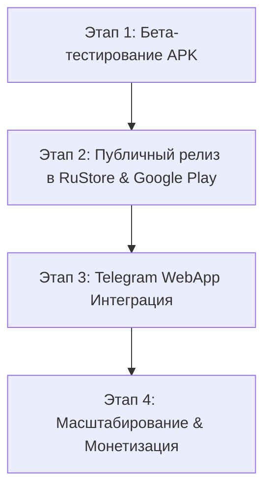

# Дорожная Карта Запуска и Маркетинга — SplitIT (Сплит-Чек 2.0)

## 📌 Архитектура Данных: Локальное Хранилище vs Supabase Cloud

> [!NOTE]
> **Как работают базы данных в SplitIT:**
> 1. **Автономный локальный режим (Offline First)**: На устройстве пользователя все созданные события, списки друзей и чеки моментально сохраняются в локальное хранилище. Это гарантирует мгновенный запуск приложения без задержек.
> 2. **Сетевая синхронизация Supabase Cloud**: При наличии подключения к интернету данные автоматически синхронизируются с базами данных PostgreSQL в Supabase через встроенный модуль [src/lib/supabase.ts](file:///Users/annafa/SplitIT/src/lib/supabase.ts). Все зарегистрированные пользователи видят общие транзакции и сплиты в реальном времени.

---

## 🚀 Этапы вывода SplitIT на рынок и тестирования



### 1. Этап 1: Закрытое бета-тестирование (1-2 недели)
- **Целевая аудитория**: Группа из 15-30 реальных тестировщиков (друзья, совместные поездки, группы аренды).
- **Дистрибуция**: Распространение готового автономного APK-файла [SplitIT-debug.apk](file:///Users/annafa/SplitIT/SplitIT-debug.apk).
- **Метрики**: 
  - Успешность регистрации новых пользователей через E-mail и Telegram.
  - Точность расчетов алгоритма минимизации долгов в реальных совместных путешествиях.
  - Удобство распознавания чеков через встроенный AI OCR.

### 2. Этап 2: Публичный релиз в RuStore и Google Play Store
- **Сборка релизного пакета AAB (Android App Bundle)**:
  ```bash
  # Сборка подписанной релизной версии для маркетов
  cd android && ./gradlew assembleRelease
  ```
- **Оформление карточки приложения**:
  - Подготовка скриншотов на базе дизайн-системы Google Stitch.
  - Позиционирование: *«Раздели чек в 1 клик без математики и обид»*.
  - Политика конфиденциальности (Privacy Policy) для Supabase Auth.

### 3. Этап 3: Интеграция с Telegram WebApp
- Подключение бот-интерфейса `SplitITBot` в Telegram.
- Пользователям не требуется скачивать APK — приложение открывается прямо внутри Telegram в 1 клик.
- Виральный механизм: при отправке инвайт-ссылки другу в Telegram, он автоматически добавляется в событие.

### 4. Этап 4: Маркетинг и Рост (Growth Hacking)
- **Виральные ссылки**: «Отправь ссылку другу, чтобы он вернул свою долю за ужин».
- **Контент-маркетинг**: Посты и рилсы на тему *«Как корректно делить расходы в путешествиях с друзьями»*.
- **Партнерства**: Интеграция с тревел-блогерами и организаторами групповых туров.
